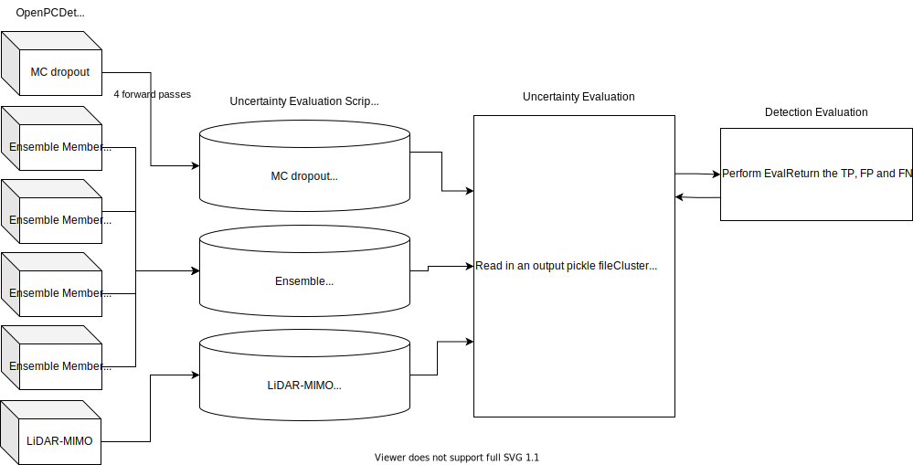
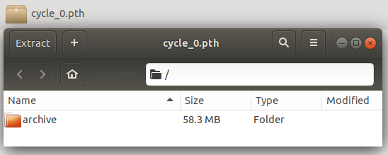
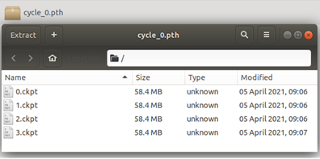

# LiDAR-MIMO
Efficient Uncertainty Estimation for LiDAR-based 3D Object Detection

# Guide

This guide contains three sections in order to recreate the results in LiDAR-MIMO. The first section goes through the three included repositories. The next section explains the setup of our modified OpenPCDet and how to train a baseline, MC dropout, ensemble or MIMO model. Lastly the final section will discuss the creation of the output files and how to run through the uncertainty evaluation pipeline.




## Included Repositories 

There are three included repositories within this package that exist in order to go through the uncertainty evaluation pipeline. 

### OpenPCDet

This repository contains new yaml files as well as code in order to train the MC dropout, ensemble and MIMO models. The main changes are the addition of the SoftMax focal loss, dropout layers in the backbone, the predicted variance output layer and the additional aleatoric loss function to train that layer. For the MIMO model additional changes were made on top of this in order to support multiple point clouds being combined and multiple detection heads during training and testing. 

### Uncertainty Evaluation

The uncertainty evaluation is first used to create the output pickle files. The code to create the output pickle files for the ensemble and MC dropout models is used to run a single network or multiple networks in order to output a pickle file with multiple outputs per frame. There is also a script to convert a pickle file output from a MIMO model from OpenPCDet to the type that our uncertainty eval repo needs. 

There are four components to our uncertainty evaluation pipeline. We first read in a pickle file and cluster the predictions in each frame using DBSCAN. The we call the detection evaluation to retrieve the TPs, FPs and FNs for each frame. Lastly, we loop through the results in order to calculate the final numbers for the calibration errors and scoring rules. 

### Detection Evaluation

This detection evaluation repo is a submodule within the uncertainty evaluation repository. It is used to perform the evaluation given a list of frames with ground truth and prediction objects for each frame. We can use this to retrieve the TPs, FPs and FNs for the uncertainty evaluation.

## OpenPCDet Setup
We've added a docker container to OpenPCDet to help with setup on new systems.

1. Change into the docker directory inside the OpenPCDet repository 

```
cd docker/
```

2. Open the config file and change the directories for “Workspace structure on host machine”. You must change “HOST_PCDET_ROOT” to the directory of OpenPCDet, “HOST_KITTI_ROOT” to the directory of your kitti dataset, “HOST_CADC_ROOT” to the directory of your cadc dataset and lastly “HOST_EVAL_ROOT” to the directory of the uncertainty eval repository. 

```
vim config.sh
```

```
# Workspace structure on host machine
HOST_PCDET_ROOT=/home/username/git/openpcdet
HOST_NUSC_ROOT=/home/username/git/openpcdet/data/nuscenes
HOST_CADC_ROOT=/home/username/git/openpcdet/data/cadc
HOST_KITTI_ROOT=/home/username/git/openpcdet/data/kitti
HOST_EVAL_ROOT=/home/username/git/uncertainty_eval
HOST_LOGDIR=/home/username/git/pcdet_output
```

3. Build the docker container 
```
./build.sh 
```

4. Run the docker container 
```
./run.sh 
```

5. Verify within the docker container that your kitti dataset and OpenPCDet directories are mounted. For how to download the kitti dataset and setup the folders read the Getting Started Document in the original OpenPCDet repository. 
```
root@f367be1280ae:~# ls 
cadc  kitti  logdir  nusc  pcdet uncertainty_eval 

root@f367be1280ae:~# ls pcdet/ 
LICENSE  README.md  build  data  dist  docker  docs  output  pcdet  pcdet.egg-info  requirements.txt  setup.py  tools 

root@f367be1280ae:~# ls kitti/ 
ImageSets    kitti_dbinfos_train.pkl         kitti_infos_test.pkl   kitti_infos_trainval.pkl  testing 
gt_database  kitti_dbinfos_train_random.pkl  kitti_infos_train.pkl  kitti_infos_val.pkl       training 
```
*** If you don’t have the gt_database and pkl files in your kitti dataset folder then they are created in step 7 (2 steps below)

6. Run the python setup files within OpenPCDet

```
cd pcdet/ 
python setup.py clean --all && python setup.py develop 
```

7. If you don’t have the pkl files and gt_database folder within the kitti dataset folder then you must create them with the create kitti info script. 

```
python -m pcdet.datasets.kitti.kitti_dataset create_kitti_infos tools/cfgs/dataset_configs/kitti_dataset.yaml
```

The OpenPCDet repository is now ready to train your models.


## OpenPCDet Training
We will now go through the training of the different models we used. The examples used are for PointPillars models, changing the yaml from pointpillar_*.yaml to second_*yaml will switch to the yaml version.

1. Each model requires you to change into the tools directory within the docker container 
```
cd ~/pcdet/tools/ 
```

### Baseline
Since we used the default baselines for models trained on the KITTI dataset from the OpenPCDet repo, we only had to train baselines for CADC. Along with the batch size and epochs arguments, we use fix and set random seed along with extra tag to set an output folder name.

```
python train.py --cfg_file cfgs/cadc_models/pointpillar.yaml --batch_size 6 --epochs 120 --fix_random_seed --set_random_seed 0 --extra_tag 120_epochs_seed_0
```

### Ensemble
We train with the same yaml file four times with different seed numbersto create four ensemble members.
```
python train.py --cfg_file cfgs/kitti_models/pointpillar_var.yaml --batch_size 6 --epochs 120 --fix_random_seed --set_random_seed 0 --extra_tag 120_epochs_seed_0
python train.py --cfg_file cfgs/kitti_models/pointpillar_var.yaml --batch_size 6 --epochs 120 --fix_random_seed --set_random_seed 1 --extra_tag 120_epochs_seed_1
python train.py --cfg_file cfgs/kitti_models/pointpillar_var.yaml --batch_size 6 --epochs 120 --fix_random_seed --set_random_seed 2 --extra_tag 120_epochs_seed_2
python train.py --cfg_file cfgs/kitti_models/pointpillar_var.yaml --batch_size 6 --epochs 120 --fix_random_seed --set_random_seed 3 --extra_tag 120_epochs_seed_3
```

### MC dropout
We train using the same yaml file as the ensemble members with the dropout layers.
```
python train.py --cfg_file cfgs/kitti_models/pointpillar_var_dropout.yaml --batch_size 6 --epochs 120 --fix_random_seed --set_random_seed 0 --extra_tag 120_epochs_seed_0
```


### LiDAR-MIMO
There are three main MIMO variants we attempted to train for our research.

### MIMO-BEV (MIMO C)
This is the main method we focus on which combines the BEV pseudo image inputs.
```
python train.py --cfg_file cfgs/kitti_models/pointpillar_mimo_var_c.yaml --batch_size 3 --epochs 120 --fix_random_seed --set_random_seed 0 --extra_tag 120_epochs_seed_0
```
### MIMO-ID (MIMO A)
This method combines point clouds with head ID features.
```
python train.py --cfg_file cfgs/kitti_models/pointpillar_mimo_var_a.yaml --batch_size 3 --epochs 120 --fix_random_seed --set_random_seed 0 --extra_tag 120_epochs_seed_0
```
### MIMO-noID (MIMO B)
This method combines point clouds without head ID features. It has much worse mAP performance.
```
python train.py --cfg_file cfgs/kitti_models/pointpillar_mimo_var_b.yaml --batch_size 3 --epochs 120 --fix_random_seed --set_random_seed 0 --extra_tag 120_epochs_seed_0
```

## Uncertainty Evaluation: Creating the output pickle files
The typical output for a pickle file from OpenPCDet is a list of dictionaries, one dictionary for each frame. The uncertainty evaluation repository expects a list of list of dictionaries. Where instead of a dictionary per frame, it contains a list of those dictionaries. One dictionary per forward pass for MC dropout, one dictionary per model for ensemble and lastly one dictionary per head for MIMO. We include the steps here to convert to the format that we need to evaluate our models.

### For all models
1. Make a folder in your logdir called output_pkls if it does not exist. Followed by a folder named kitti and cadc.
```
/root/logdir/output_pkls/kitti
/root/logdir/output_pkls/cadc
```

2. You should also copy over the kitti_infos_val.pkl file from /root/kitti/ into that folder. Do the same for the cadc_infos_val.pkl to the cadc folder.

### MC dropout
1. Within the pcdet/tools directory of the docker container run these commands to create the log directories for MC dropout.
```
python ../../uncertainty_eval/create_pkls/main.py --cfg_file cfgs/kitti_models/pointpillar_var.yaml --batch_size 6 --ensemble_type=mcdropout --ensemble_size=4 --logdir_root /root/logdir/
```

You should be able to see these directories 
```
root@301eb32cdc91:~/pcdet/tools# ls /root/logdir/al_log/kittidatasetvar/pointpillarvar.mcdropout/init_model 
dbinfos  output  queried_data.json  saved_models  train_log 
```

2. For MC dropout you must place a single checkpoint in the saved_models folder renamed to cycle_0.pth 



3. To create the output pickle files you can rerun the commands from step 1 
```
python ../../uncertainty_eval/create_pkls/main.py --cfg_file cfgs/kitti_models/pointpillar_var.yaml --batch_size 6 --ensemble_type=mcdropout --ensemble_size=4 --logdir_root /root/logdir/
```

4. Now there should be a gts.pkl file and preds.pkl file within the output folders. You can delete the gts.pkl file.
```
root@301eb32cdc91:~/pcdet/tools# ls /root/logdir/al_log/kittidatasetvar/pointpillarvar.mcdropout/init_model/output/test/ 
gts.pkl  preds.pkl 
```

5. Rename preds.pkl to pp_mcdropout.pkl and place it into the kitti output folder
```
/root/logdir/output_pkls/kitti
```

### Ensemble
1. Within the pcdet/tools directory of the docker container run these commands to create the log directories for ensemble.
```
python ../../uncertainty_eval/create_pkls/main.py --cfg_file cfgs/kitti_models/pointpillar_var.yaml --batch_size 6 --ensemble_type=ensemble --ensemble_size=4 --logdir_root /root/logdir/
```
You should be able to see these directories 
```
root@301eb32cdc91:~/pcdet/tools# ls /root/logdir/al_log/kittidatasetvar/pointpillarvar.ensemble/init_model 
dbinfos  output  queried_data.json  saved_models  train_log 
```

2. For Ensemble you must put a zip file called cycle_0.pth with each of the 4 checkpoints labeled 0.ckpt to 3.ckpt within the saved_models folder 



3. To create the output pickle files you can rerun the commands from step 1 
```
python ../../uncertainty_eval/create_pkls/main.py --cfg_file cfgs/kitti_models/pointpillar_var.yaml --batch_size 6 --ensemble_type=ensemble --ensemble_size=4 --logdir_root /root/logdir/
```

4. Now there should be a gts.pkl file and preds.pkl file within the output folders. You can delete the gts.pkl file.
```
root@301eb32cdc91:~/pcdet/tools# ls /root/logdir/al_log/kittidatasetvar/pointpillarvar.ensemble/init_model/output/test/ 
gts.pkl  preds.pkl 
```

5. Rename preds.pkl to pp_mcdropout.pkl and place it into the kitti output folder
```
/root/logdir/output_pkls/kitti
```

### Lidar-MIMO
1. First run the test script to get the original list(dict) output from MIMO. Each dictionary has been modified with an extra attribute which contains a list of dictionaries one for each head. It can only be run with batch size of 1 at this moment. 
```
cd ~/pcdet/tools/
python test.py --cfg_file cfgs/kitti_models/pointpillar_mimo_var_c.yaml --batch_size 1 --ckpt ../output/kitti_models/pointpillar_mimo_var_c/120_epochs_seed_0/ckpt/checkpoint_epoch_120.pth
```

You should be able to see a pickle file in this directory: 
```
ls /root/pcdet/output/kitti_models/pointpillar_mimo_var_a/default/eval/epoch_40/val/default/ 
result.pkl 
```

5. Rename result.pkl to pp_mimo_c_raw.pkl and place it into the kitti output folder.
```
/root/logdir/output_pkls/kitti
```

3. Then convert the pickle file to the format for the uncertainty evaluation repository by using the mimo_convert_pkl script. The first argument is the full path of the original output pickle file and the second is the full path to output the converted file.
```
cd ~/uncertainty_eval/create_pkls
python mimo_convert_pkl.py /root/logdir/output_pkls/pp_mimo_c_raw.pkl /root/logdir/output_pkls/pp_mimo_c.pkl
```

## Uncertainty Evaluation: Execution time

When running the OpenPCDet test script for evaluation you can see output for mean data processing time as well as mean forward pass time. Note that for all models we will be using only one worker and one batch size.

### For all models
You also need to uncomment out some code within “/root/pcdet/pcdet/models/backbones_2d/base_bev_backbone.py” line 94-99. Also uncomment the code on lines 126-131 within “/root/pcdet/pcdet/models/backbones_2d/base_bev_backbone_mimo.py”.

```
# Timing count 
if not self.training:
self.bb_time_diffs.append(time.time() - data_dict['start_time'])
  self.bb_frame_count += 1
  if self.bb_frame_count == 3769:
    print('mean time to backbone', np.mean(self.bb_time_diffs))
```

### Ensemble 
To run an ensemble model:
```
python test.py --cfg_file cfgs/kitti_models/pointpillar_var.yaml --batch_size 1 --workers 1 --ckpt ../output/kitti_models/pointpillar_var/120_epochs_seed_0/ckpt/checkpoint_epoch_120.pth --extra_tag 120_epochs_seed_0
```

### MC dropout
For MC dropout you must uncomment the apply dropout line within “/root/pcdet/tools/eval_utils/eval_utils.py” on line 55. This will enable the dropout layers during testing.
```
# Enable only for MC-Dropout timing 
model.apply(apply_dropout) 
```

Then you can run the MC dropout model:
```
python test.py --cfg_file cfgs/kitti_models/pointpillar_var_dropout.yaml --batch_size 1 --workers 1 --ckpt ../output/kitti_models/pointpillar_var_dropout/120_epochs_seed_0/ckpt/checkpoint_epoch_120.pth --extra_tag 120_epochs_seed_0
```


### LiDAR-MIMO
To run a LiDAR-MIMO model, this example runs MIMO-BEV:
```
python test.py --cfg_file cfgs/kitti_models/pointpillar_mimo_var_c.yaml --batch_size 1 --workers 1 --ckpt ../output/kitti_models/pointpillar_mimo_var_c/120_epochs_seed_0/ckpt/checkpoint_epoch_120.pth --extra_tag 120_epochs_seed_0 
```

### Log file
The data processing time, time to backbone and forward pass time is all outputted to the "log_eval_*.txt" file where the results pickle is output.

Example:
```
2021-11-12 03:24:02,739   INFO  *************** EPOCH 120 EVALUATION *****************
2021-11-12 03:26:11,506   INFO  Mean data processing time: 0.0170 s
2021-11-12 03:26:11,558   INFO  mean time to backbone: 0.0039 s
2021-11-12 03:26:11,623   INFO  mean forward pass time: 0.0286 s
2021-11-12 03:26:11,623   INFO  *************** Performance of EPOCH 120 *****************
```

## Uncertainty Evaluation: Running the evaluation
There are two bash scripts that have been made to easily run the multiple script files to get results.

***Note there is a bug you might see in the uncertainty-calibration repository. If you see the bug you must change a few lines in the file that the error occurs 

For example the error will be output this file: 
```
vim /usr/local/lib/python3.6/dist-packages/calibration/utils.py 
```

Then you must modify two lines on line 507 and 508 to this: 
```
    assert np.min(labels) >= 0 
    assert np.max(labels) <= k - 1 
```

### run_all_compute_ap.sh
This file calls the compute_average_precision.py script for each run.

There are 4 arguments
1. The dataset. Could be set to KITTI or CADC
2. Model type. -1 is baseline, 0 is MC dropout, 1 is ensemble, 2-4 is MIMO ID, noID, BEV.
3. Cluster type. For our testing we set to 1 for consensus clustering
4. The pickle file name

An example:
```
python compute_average_precision.py KITTI -1 1 pp_openpcdet.pkl
python compute_average_precision.py KITTI 0 1 pp_mcdropout.pkl
python compute_average_precision.py KITTI 1 1 pp_ensemble.pkl
python compute_average_precision.py KITTI 4 1 pp_mimo_c.pkl
```

The output is put into "~/logdir/output_pkls/kitti/final_output/" and labeled with the pickle file followed by "_compute_ap.csv" and contains the mAP and detection partition counts.

```
cat ~/logdir/output_pkls/kitti/final_output/pp_mimo_a.pkl_compute_ap.csv
Car AP,Ped AP,Cyc AP,mAP,TP,FP_ML,FP_BG
76.72,51.27,64.87,64.29,8250,3905,53593
```

### run_all_uncertainty_eval.sh
This file calls the run_uncertainty_val.sh script for each run.

There are 4 arguments
1. The dataset. Could be set to KITTI or CADC
2. The pickle file name
3. Model type. -1 is baseline, 0 is MC dropout, 1 is ensemble, 2-4 is MIMO ID, noID, BEV.
4. Cluster type. For our testing we set to 1 for consensus clustering

An example:
```
bash run_uncertainty_eval.sh KITTI pp_mcdropout.pkl 0 1
bash run_uncertainty_eval.sh KITTI pp_ensemble.pkl 1 1
bash run_uncertainty_eval.sh KITTI pp_mimo_c.pkl 2 1
```

The output is put into "~/logdir/output_pkls/kitti/final_output/" and labeled with the pickle file followed by "_uncertainty_eval.csv" and contains the uncertainty scores and calibration errors.

```
cat ~/logdir/output_pkls/kitti/final_output/second_mimo_a.pkl_uncertainty_eval.csv 
CLS NLL TP,CLS NLL FP_ML,CLS NLL FP_BG,CLS Brier TP,CLS Brier FP_ML,CLS Brier FP_BG,REG NLL TP,REG NLL FP_ML,REG Energy TP,REG Energy FP_ML,MCE,REG ECE
0.805,1.0483,0.4724,0.6018,0.7147,0.3016,-5.5405,-2.065,0.2982,0.5981,0.1876,0.0631
```

## Citation
    @INPROCEEDINGS{9827244,
        author={Pitropov, Matthew and Huang, Chengjie and Abdelzad, Vahdat and Czarnecki, Krzysztof and Waslander, Steven},
        booktitle={2022 IEEE Intelligent Vehicles Symposium (IV)}, 
        title={LiDAR-MIMO: Efficient Uncertainty Estimation for LiDAR-based 3D Object Detection}, 
        year={2022},
        volume={},
        number={},
        pages={813-820},
        doi={10.1109/IV51971.2022.9827244}
    }
